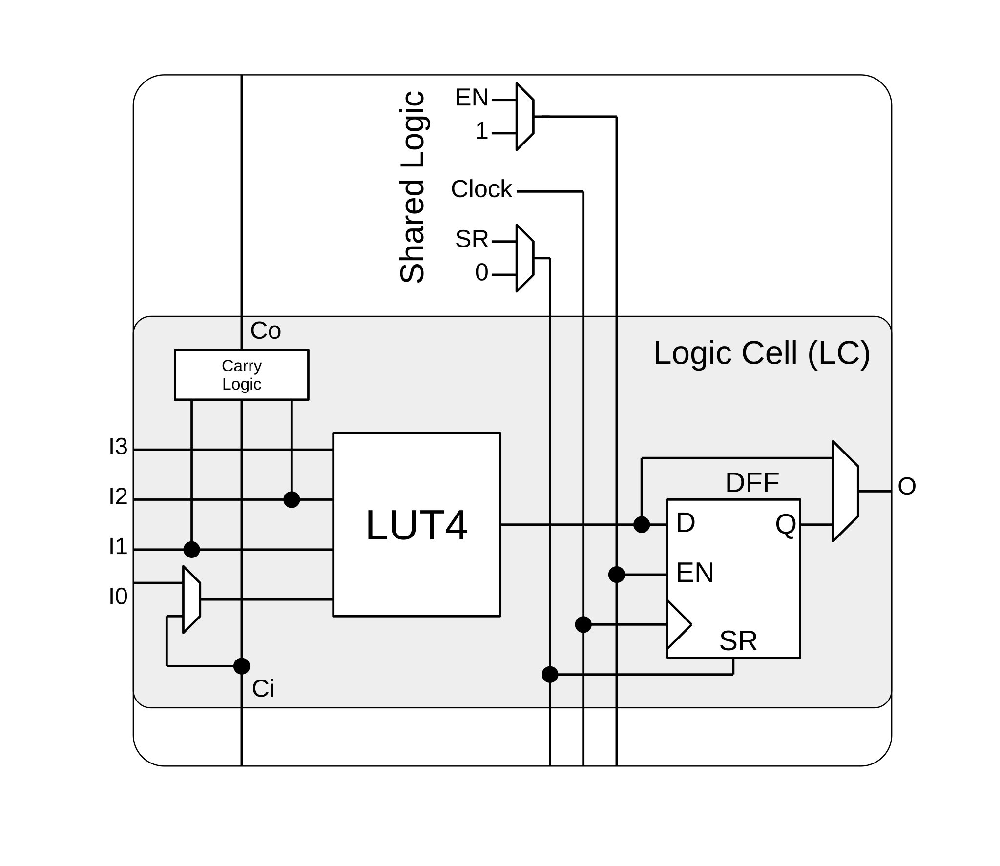
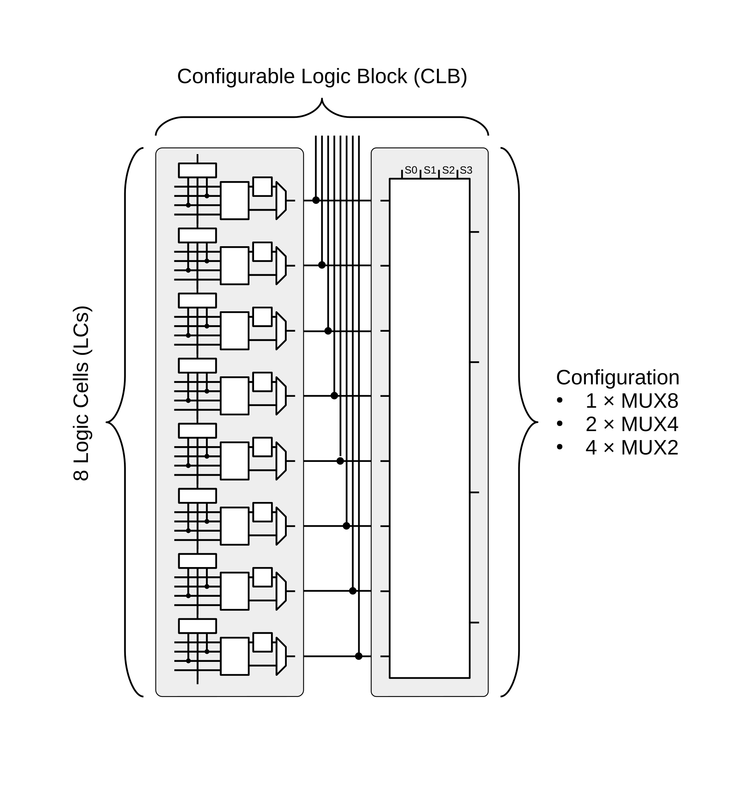
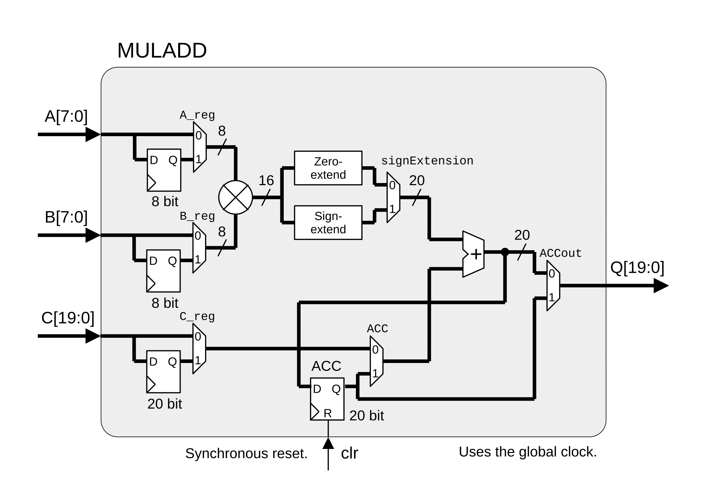
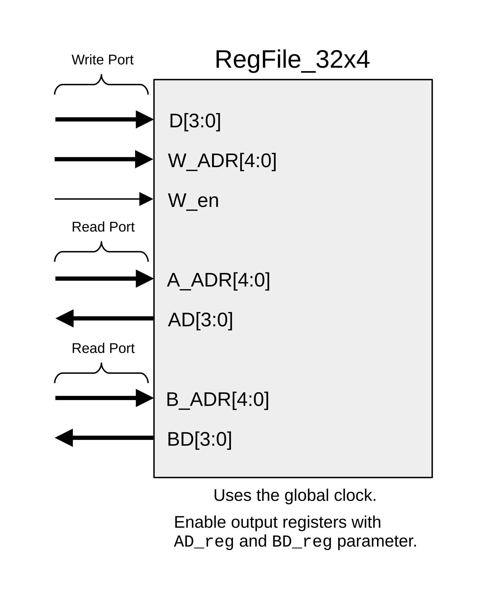
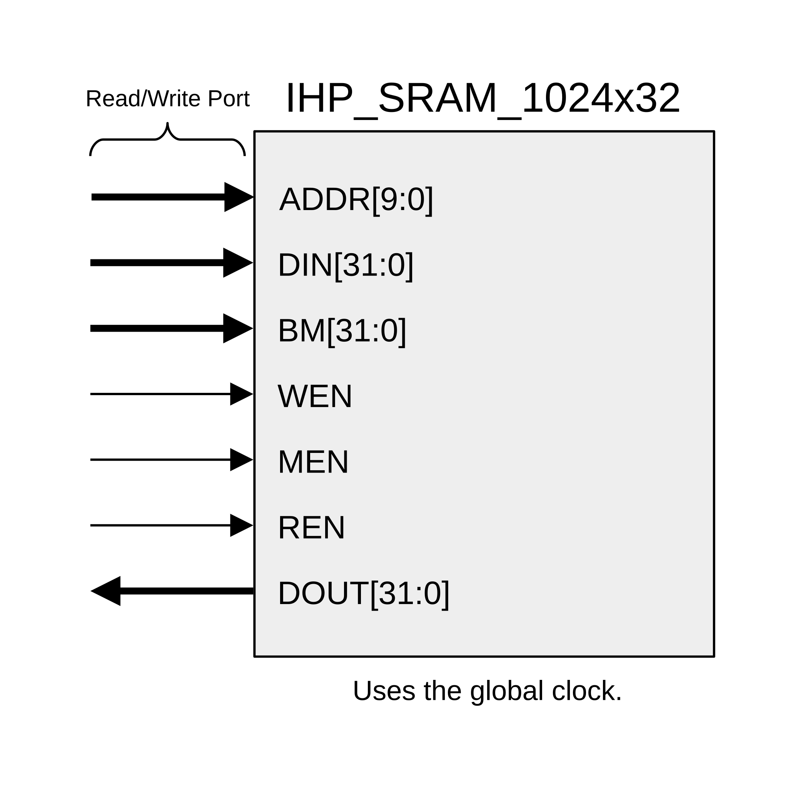
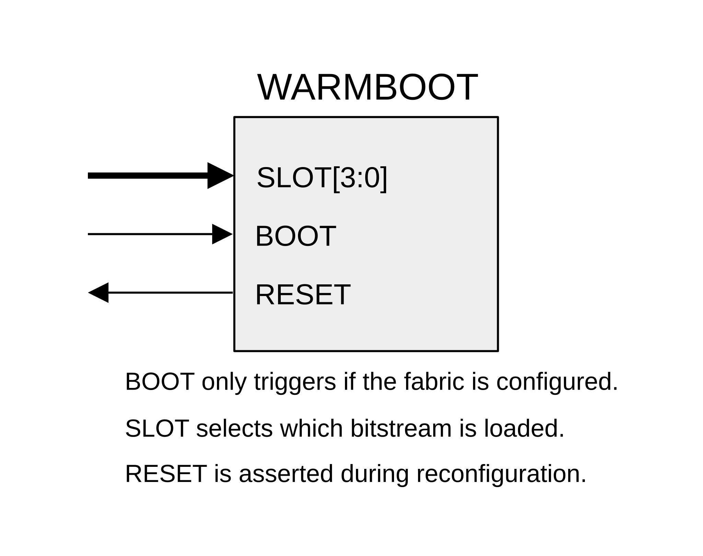
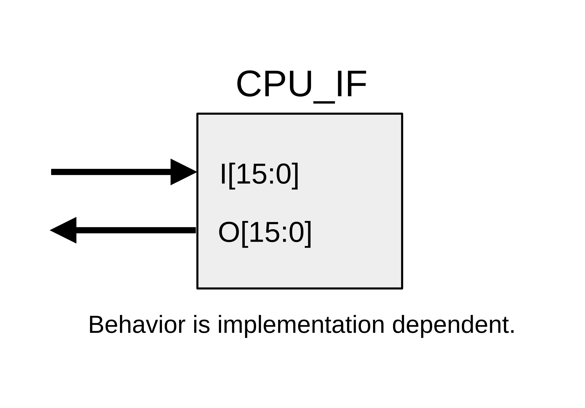
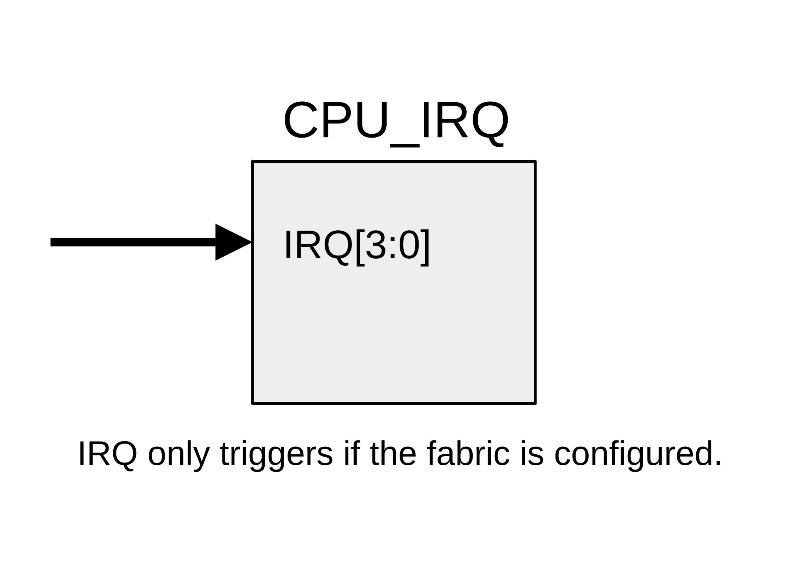

# Primitives

Here are some of the primitives, also called basic elements (BELs), that you can find in FABulous fabrics.

## Logic Cell (LC)

The LUT4 of the logic cell can implement any combinatorial logic function with up to 4 inputs; it has a carry logic for a fast carry chain at its inputs. The D-FF is the memory element of the LC and is fed by the output of the LUT. It shares its clock and control signals with the other LCs in the CLB. A multiplexer at the output selects either the LUT4 or the D-FF.

## Configurable Logic Block (CLB)

The CLB is the heart of the fabric, but it's not a primitive by itself. Each CLB contains 8 LCs, a fast carry chain and one MUX. The MUX is fed by the outputs of the LCs and can be configured as 1xMUX8, 2xMUX4 or 4xMUX2.

## Multiply Accumulate

The `MULADD` primitive performs a MAC (Multiply Accumulate) operation. It has two 8-bit wide inputs A and B, which are multiplied together, and a separate 20-bit wide input C, which can be used for the accumulation. There is also the ACC register to continuously accumulate values.

### Ports

| Port Name    | Width | Direction | Function                 |
|--------------|-------|-----------|--------------------------|
| A            | 8     | Input     | Multiplier input A.      |
| B            | 8     | Input     | Multiplier input B.      |
| C            | 20    | Input     | Accumulator input C.     |
| clr          | 1     | Input     | Clear the accumulator, synchronous. |
| Q            | 20    | Output    | Final output.            |

### Parameters

| Parameter Name | Width | Function                 |
|----------------|-------|--------------------------|
| A_reg          | 1     | Enable input A register. |
| B_reg          | 1     | Enable input B register. |
| C_reg          | 1     | Enable input C register. |
| signExtension  | 1     | If `1` sign-extend the multiplier output to 20 bit. |
| ACC            | 1     | If `0` select C as second input to the accumulator, if `1` select ACC as second input. |
| ACCout         | 1     | If `0` output the accumulation result, if `1` output ACC. |

## Register File

The `RegFile` primitive offers 32 x 4 bit memory with 2 read ports and 1 write port. The reads can be synchronous or asynchronous.

### Ports

| Port Name    | Width | Direction | Function                 |
|--------------|-------|-----------|--------------------------|
| D            | 4     | Input     | Write Data.              |
| W_ADR        | 5     | Input     | Write address.           |
| W_en         | 1     | Input     | Synchronous write enable. |
| A_ADR        | 5     | Input     | Read address port A.     |
| AD           | 4     | Output    | Read data port A.        |
| B_ADR        | 5     | Input     | Read address port B.     |
| BD           | 4     | Output    | Read data port B.        |

### Parameters

| Parameter Name | Width | Function                 |
|----------------|-------|--------------------------|
| AD_reg         | 1     | Enable output A register. |
| BD_reg         | 1     | Enable output B register. |

## IHP SRAM

The `IHP_SRAM_1024x32` primitive has 1024 x 32 bit of memory with one read/write port and individual bit enable for writes.

### Ports

| Port Name    | Width | Direction | Function                 |
|--------------|-------|-----------|--------------------------|
| ADDR         | 10    | Input     | Address input.           |
| DIN          | 32    | Input     | Data input.              |
| BM           | 32    | Input     | Bit mask for writes.     |
| WEN          | 1     | Input     | Enable writes.           |
| MEN          | 1     | Input     | Enable the memory.       |
| REN          | 1     | Input     | Enable reads.            |
| DOUT         | 32    | Output    | Data output.             |

## Warmboot

The `WARMBOOT` enables reconfiguring the fabric from one of 16 slots.

### Ports

| Port Name    | Width | Direction | Function                 |
|--------------|-------|-----------|--------------------------|
| SLOT         | 4     | Input     | Select the slot for reconfiguration. |
| BOOT         | 1     | Input     | If `1` trigger reconfiguration. |
| RESET        | 1     | Output    | Asserted (active high) during reconfiguration. |

## CPU Interface

`CPU_IF` is primitive with 16 inputs and 16 outputs for the CPU domain. Its purpose is implementation dependent. On [Greyhound](https://github.com/mole99/greyhound-ihp/tree/main) 4x `CPU_IF` are used to implement the custom instruction and peripheral interface.

### Ports

| Port Name    | Width | Direction | Function                 |
|--------------|-------|-----------|--------------------------|
| I            | 16    | Input     | Implementation dependent. |
| O            | 16    | Output    | Implementation dependent. |

## CPU Interrupt Request

`CPU_IRQ` is used to send IRQs to the CPU domain.

### Ports

| Port Name    | Width | Direction | Function                 |
|--------------|-------|-----------|--------------------------|
| IRQ          | 4     | Input     | One-hot encoded, active-high, trigger IRQ0 to IRQ3. |